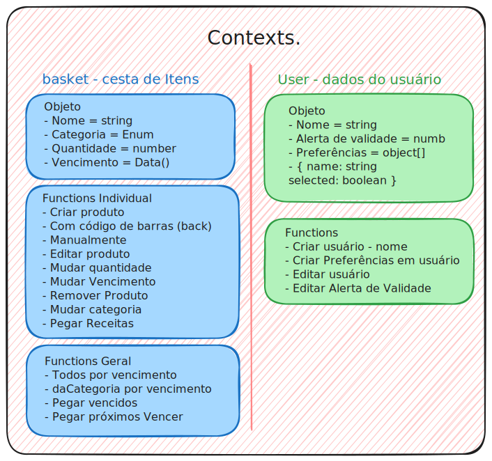

# 🚀 Branch Develop => App !Waste 🦑

Começando a usar estrutura de trabalho mais coerente onde a partir da Develop criaremos novas features

---

## ✅ Controle de Atividades 

Atividades passadas ao [Trelo da !KrakeN](https://trello.com/b/JW9SfSb7/waste)
Layouts by [Rafael Figma](https://www.figma.com/design/rCq7qrpH8J47DpSxrQ53Mw/Jobs?node-id=3533-134&node-type=canvas&t=u6NlPTYBBeYS2oHO-0)

---
## Lista de funções em Context
-[ ] Criar as funções e contestos abaixo



## 📦 Como Iniciar o App  

1. **Instale a extensão recomendada**  
   👉 [React Native Tools](https://marketplace.visualstudio.com/items?itemName=msjsdiag.vscode-react-native) no **VS Code**.

2. **Clone o repositório**  
   Use o comando:  
   ```bash
   git clone https://github.com/RenanKr4t0s/krakenRnative-one.git
   ```  

3. **Acesse o diretório do projeto**  
   ```bash
   cd krakenRnative-one/
   ```  

4. **Instale as dependências**  
   ```bash
   npm install
   ```  

5. **Inicie o Expo e o aplicativo**  
   ```bash
   npx expo start
   ```  

6. **Baixe o aplicativo Expo Go no seu celular**  
   - [Expo Go para Android](https://play.google.com/store/apps/details?id=host.exp.exponent&hl=pt_BR)  
   - Busque na App Store caso use iOS.

7. **Leia o QR Code**  
   Use o Expo Go para escanear o QR Code gerado no terminal. 📱  
   Pronto! Seu app estará rodando. 🚀  

---

Boa jornada de desenvolvimento, equipe **KrakeN**! 🦑🔥